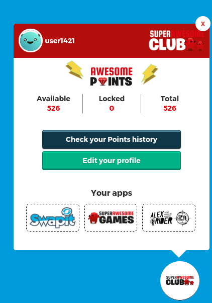

Add-ons
========

Awesome Bar
^^^^^^^^^^^^

The Awesome Bar is an add-on that includes a quick way for the user to check the summary of points and also quickly go to the club for updating the profile or looking at the points history.

When the Awesome Bar is included, signed users will see a button at the bottom right of the site. They can use that button to toggle the Awesome Bar on and off

    (The Awesome Bar gives a quick summary of the points of the user and quick links to go the club to manage the profile)

Adding the Awesome Bar
-----------------------

The Awesome Bar works as an add-on of the Frontend SDK. It can be added like this:

Step 1. Add Frontend SDK and Awesome Bar in sources

.. code-block:: html

    <head>
        <!-- (...) -->

        <!-- KWS SDK STYLES AND DEPENDENCIES-->
        <link href="https://maxcdn.bootstrapcdn.com/font-awesome/4.4.0/css/font-awesome.min.css" rel="stylesheet" type="text/css">
        <link href="https://s3-eu-west-1.amazonaws.com/sa-kws-frontend-sdk/v1.0.0/sa-kws-frontend-sdk-1.0.0.min.css" rel="stylesheet" type="text/css">
        <!-- AWESOME BAR STYLES-->
        <link href="https://s3-eu-west-1.amazonaws.com/sa-kws-frontend-sdk/v1.0.0/sa-kws-bar-sdk-1.0.0.min.css" rel="stylesheet" type="text/css">
    </head>

    <body>
        <!-- (...) -->

        <!-- KWS SDK AND DEPENDENCIES-->
        
        
